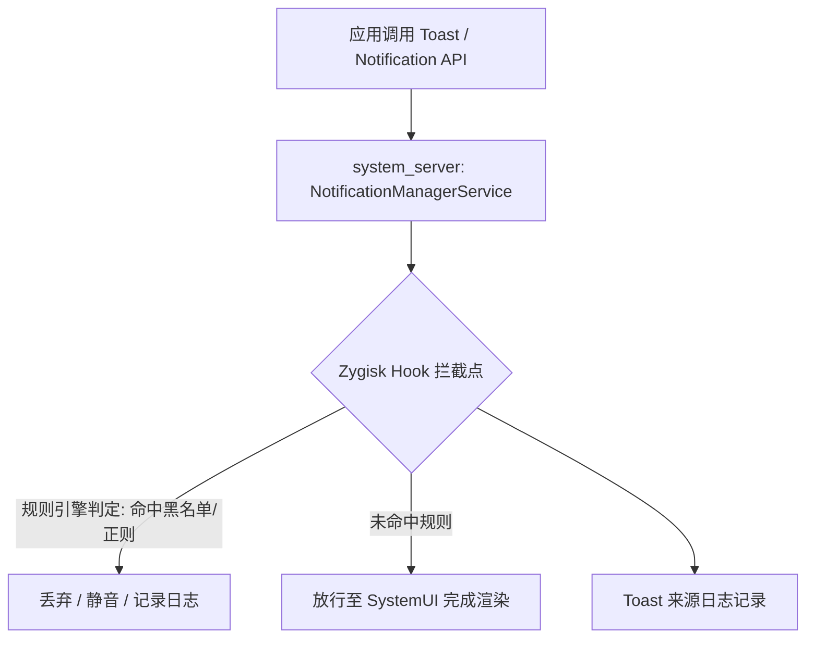

# ToastMagers - Android 通知与 Toast 弹窗拦截系统

[](https://github.com/topjohnwu/Magisk)
[](https://developer.android.com/)
[](LICENSE)
[](#开发状态)

ToastMagers 是面向 Root 环境（Magisk / KernelSU / APatch）的系统级通知与 Toast 弹窗拦截模块，用于处理应用层广告推送、常驻无效通知及后台静默弹窗。模块通过 Zygisk API 在系统进程内建立方法级 Hook，在通知/Toast 提交系统服务前完成规则匹配与拦截。

## 开发状态

本项目当前处于设计与早期开发阶段，尚未发布可用于生产环境的正式版本。以下文档描述的是目标实现方案，部分接口细节（正则引擎选型、Hook 目标签名、companion 进程通信协议等）将在开发推进过程中确认并同步更新本文档。已标注 **[待实现]** 的条目表示设计目标而非已验证行为。

---

## 核心特性

- **系统进程内拦截**：目标是在 `system_server` 进程内对 `NotificationManagerService`（NMS）相关方法建立 ART 层 Hook，在通知/Toast 提交给上层展示逻辑（SystemUI）之前完成拦截判定。**[待实现]**
- **Toast 弹窗来源溯源**：记录发起 Toast 调用的应用包名、调用时间及（如可获取）调用堆栈摘要，用于定位后台静默弹窗来源。
- **通知渠道锁定**：限制指定应用对 `NotificationChannel` 的运行时重建或重要性重置行为，防止应用绕过用户已设置的通知限制。
- **应用清单扫描**：枚举设备中具备通知能力的已安装应用（而非要求手动录入包名），作为规则匹配与 WebUI 展示的数据基础，具体识别策略见〈应用清单扫描与 WebUI 管理〉一节。**[待实现]**
- **规则引擎**：支持正则表达式、关键字匹配与包名精确/通配匹配的组合过滤，规则匹配对象为扫描得到的已安装应用清单，可按应用单独配置优先级、静音、自动清除或整体屏蔽策略。
- **WebUI 管理界面**：提供基于浏览器/内置 WebView 的可视化配置界面，覆盖应用清单浏览、规则开关、日志查看，替代直接编辑 `config.json` 的操作方式。**[待实现]**
- **系统权限状态同步**：规则开关状态与系统「设置 → 应用 → 通知」中的权限状态保持一致，避免系统 UI 显示与模块实际拦截行为不一致。**[待实现，详见下节]**
- **Systemless 部署**：以 Magisk 模块形式挂载，不新增常驻 Service 组件；资源占用与设备型号、规则数量及 Hook 触发频率相关，具体开销建议在目标设备上通过 Profiler 实测，本文档不作预先量化承诺。
- **规则导入/导出**：支持 JSON 格式规则文件的导出与导入，便于规则集迁移与共享。**[待实现：云端订阅机制]**

---

## 系统与环境要求

| 项目 | 说明 |
| --- | --- |
| Android 版本 | Android 10（API 29）～ Android 15（API 35）。实际上限取决于所用 Zygisk 实现对当前 ART 版本的适配情况，新系统版本需在发布前单独验证 |
| Root 方案 | Magisk / KernelSU / APatch，三者均可运行，但均依赖可用的 **Zygisk API 实现**（见下） |
| Zygisk 实现 | **Magisk**：使用内置 Zygisk（App 内设置项开启）。部分 Canary/较新版本曾出现内置 Zygisk 注入异常的已知问题，如遇模块无法加载可改用独立实现替代。<br>**KernelSU / APatch**：官方均不内置 Zygisk，需额外安装 [Zygisk Next](https://github.com/Dr-TSNG/ZygiskNext)、ReZygisk 或 NeoZygisk 任一独立实现作为前置依赖 |
| 系统架构 | arm64-v8a / armeabi-v7a / x86_64 |
| WebUI 支持 | **KernelSU**：官方原生支持，通过 Manager 内置 WebView 加载模块 `webroot/index.html`。<br>**Magisk**：自较新版本（官方发行日志显示 v28.1 起）原生支持同一约定；使用旧版本或 Magisk Delta/Kitsune 等第三方分支时可能不具备该能力，需在实现阶段以当前版本发行说明为准核实。<br>**APatch**：模块系统（APM）与 Magisk/KernelSU 存在差异，是否原生支持及支持方式需在开发阶段单独确认，必要时可评估 WebUI X（MMRL）等第三方兼容层作为跨方案统一方案 |
| 本地编译环境 | Android NDK r25c 及以上、CMake 3.22.1 及以上、Gradle 8.0 及以上 |

> 由于 Root 生态中 Zygisk 实现的兼容状态随各方案版本更新而变化，安装前建议在目标设备上先确认 Zygisk 处于正常注入状态，再刷入本模块。

---

## 安装指南

### 1. 确认 Zygisk 可用

- **Magisk**：进入 Magisk App → 设置，开启「Zygisk」。若开启后模块提示注入失败，可尝试关闭内置 Zygisk 并改为刷入 Zygisk Next 等独立实现。
- **KernelSU / APatch**：先从对应管理器刷入 Zygisk Next / ReZygisk / NeoZygisk 中的一个模块，重启后确认该模块显示为已生效状态，再继续下一步。

### 2. 安装 ToastMagers

1. 前往本仓库 [Releases](../../releases) 页面下载 `ToastMagers-vX.Y.Z.zip`。
2. 打开 Magisk App / KernelSU App / APatch Manager，进入「模块」页面。
3. 选择「从本地安装」，选取下载好的 ZIP 文件并等待刷入完成。
4. 重启设备使模块生效。

### 3. 验证运行状态

```bash
su -c logcat -s ToastMagers
```

若日志中出现类似 `[ToastMagers] Engine initialized successfully.` 的记录，说明 Hook 已在目标进程内成功加载；若无输出，优先排查 Zygisk 注入状态，而非直接假定模块本身存在问题。

---

## 配置文件说明

配置文件路径：`/data/adb/modules/toast_magers/config.json`

### 示例结构

```json
{
  "version": 1,
  "settings": {
    "enable_toast_tracker": true,
    "show_toast_source_overlay": false,
    "log_level": "INFO"
  },
  "webui": {
    "enabled": true,
    "require_auth": false
  },
  "whitelist_packages": [
    "com.android.systemui",
    "com.android.phone"
  ],
  "global_rules": [
    {
      "name": "屏蔽营销类关键字弹窗",
      "type": "regex",
      "pattern": ".*(领红包|限时特惠|点击领取|充值优惠).*",
      "action": "BLOCK"
    }
  ],
  "app_rules": {
    "com.example.rogueapp": {
      "block_all_toasts": true,
      "block_notification_channels": ["ad_channel", "marketing"],
      "force_silent": true,
      "auto_dismiss_delay_ms": 0,
      "sync_system_state": true
    }
  }
}
```

### 字段说明

| 字段 | 说明 |
| --- | --- |
| `enable_toast_tracker` | 是否记录 Toast 调用来源日志 |
| `show_toast_source_overlay` | 是否在 Toast 弹出时附加来源包名提示 |
| `webui.enabled` | 是否启用 WebUI 管理界面，关闭后仅能通过直接编辑本文件配置 |
| `webui.require_auth` | WebUI 是否要求访问口令，局域网/多用户设备环境下建议开启 |
| `whitelist_packages` | 始终放行、不参与规则匹配的包名列表，建议保留系统核心组件与常用通讯应用 |
| `global_rules` | 全局规则，作用于所有未在白名单中的应用 |
| `app_rules` | 针对指定包名的专属过滤策略，优先级高于全局规则 |
| `app_rules.*.sync_system_state` | 该应用规则是否同步为系统级通知启用/禁用状态，语义与限制详见〈规则开关与系统通知权限状态同步〉一节 |
| 正则表达式语法 | 待实现阶段确定绑定的正则库后在此补充具体语法规范（如 ECMA-262 或 Java `Pattern`） |

配置变更后建议先在测试设备上验证白名单是否覆盖核心通讯应用，避免误拦截造成消息遗漏。

---

## 技术方案（设计说明）

Android 10 及以上版本中，Toast 的实际展示流程已由应用进程直接持有窗口（`WindowManagerGlobal` + `TYPE_TOAST`）逐步收敛为经由 `NotificationManagerService.enqueueToast()` 统一提交至 `system_server`，再转交 SystemUI 完成渲染。这一变化使得在 `system_server` 层面进行集中拦截成为可行路径，也是本模块的核心设计前提。



设计要点：

1. **进程注入**：Zygisk 模块声明对 `system_server` 进程生效（而非仅面向普通应用进程），使 Hook 点能够覆盖所有应用发起的通知/Toast 请求，而不需要逐个应用单独注入。
2. **方法级 Hook**：计划使用 ART 方法 Hook 手段（如业界常见的 Dobby / SandHook 等原生 Hook 框架，具体选型待定）拦截 `NotificationManagerService` 中 `enqueueToast` / `enqueueNotificationWithTag` 等相关方法的调用。**[待实现]**
3. **规则匹配**：在 Hook 回调中同步执行规则引擎判定，避免引入额外线程切换带来的时序问题。
4. **日志与溯源**：Hook 回调中记录调用方包名与时间戳，供 Toast 溯源功能使用。

> 以上为目标技术路径，实际可行性和实现细节（尤其是不同厂商定制 ROM 对 NMS 方法签名的修改）需在开发与测试阶案段逐一验证，本节内容不构成已验证的实现承诺。

---

## 应用清单扫描与 WebUI 管理（设计说明）**[待实现]**

### 应用清单扫描

区别于要求用户手动输入包名，模块计划提供已安装应用的自动清单，供规则匹配与 WebUI 展示使用。识别「具备通知能力」的应用拟采用分层策略：

1. **基础清单**：通过 `PackageManager`（`pm list packages` 或等价 API）枚举全部已安装应用，作为候选集合。
2. **通知能力标记**：由于 Hook 逻辑运行在 `system_server` 进程内，可直接访问 `NotificationManagerService` 的运行时状态（如已注册的 `NotificationChannel`、历史通知记录），据此标记应用是否「实际使用过通知」，而非仅依赖静态清单，识别精度优于单纯遍历已安装应用列表。
3. **权限信号（Android 13 及以上）**：叠加 `POST_NOTIFICATIONS` 运行时权限的授予状态作为辅助判定信号；该权限在 Android 13（API 33）以下不存在，低版本系统需完全依赖上述第 2 点的运行时记录。

该清单作为规则匹配的对象基础：用户在 WebUI 中看到的是「设备上实际存在、且可判定通知行为」的应用列表，而非需要自行输入的裸包名。

### WebUI 管理界面

按 Magisk 生态的通用约定，WebUI 以模块目录下的 `webroot/index.html` 作为入口，由对应 Root 管理器内置 WebView 加载，并通过 JavaScript 桥接对象调用 Shell 命令读写模块状态（而非独立运行一个本地 HTTP 服务）。不同 Root 方案的支持现状见〈系统与环境要求〉表中的说明，实现时需按目标方案分别验证。

计划提供的界面能力：

- 应用清单浏览：展示扫描得到的应用列表及当前规则状态。
- 规则开关：对单个应用或全局规则进行启用/禁用及编辑。
- Toast 溯源日志查看：呈现〈核心特性〉中「Toast 弹窗来源溯源」记录的调用来源与时间。
- 配置导入/导出的图形化入口。

### 规则开关与系统通知权限状态同步

规则开关状态与系统「设置 → 应用信息 → 通知」中的权限状态存在两种不同粒度的控制层级，需分别说明并加以协调：

1. **Hook 层拦截**（细粒度）：基于关键字/正则的规则判定发生在 Hook 回调内，属于「应用认为通知已发出，但在系统层被拦截」的静默丢弃，系统设置中的通知开关不会因此发生变化。
2. **系统状态同步**（粗粒度）：当规则将某应用设置为整体屏蔽（如 `block_all_toasts` 生效）时，计划由 Hook 逻辑直接调用 `NotificationManagerService` 内部的通知启用状态设置方法（该方法在原生实现中通常仅限系统签名应用调用；由于本模块的 Hook 代码运行在 `system_server` 进程地址空间内，理论上可直接操作服务的运行时状态，而不必经过面向第三方应用的 Binder 权限检查，但该路径需在实现阶段验证其稳定性与副作用），使系统设置界面显示的通知开关与模块规则保持一致。

需要明确的限制：系统层的启用/禁用状态只能表达「整体开/关」，无法表达关键字级别的细粒度过滤；因此系统开关应被理解为「该应用是否存在生效的整体屏蔽规则」的聚合状态指示，而非对底层全部规则逻辑的精确映射。此外，系统级禁用属于应用可感知的行为（应用可通过 `NotificationManagerCompat.areNotificationsEnabled()` 等 API 得知自身通知已被禁用），与纯 Hook 层静默拦截（应用通常无法感知）在行为可见性上存在本质差异，两者的取舍需要结合具体使用场景决定，本文档不预设默认策略。

---

## 已知限制

- **厂商定制 ROM 兼容性未知**：MIUI、ColorOS、OriginOS、HarmonyOS（基于 AOSP 分支）等系统对 NMS 及通知管道存在不同程度的定制，Hook 目标方法签名可能与原生 AOSP 不一致，需逐一适配和测试，不能假定「装上即可用」。
- **非标准渲染路径无法覆盖**：部分应用通过自定义悬浮窗（`TYPE_APPLICATION_OVERLAY` 等）模拟 Toast 效果而非调用系统 Toast API，此类内容不在 NMS 拦截范围内，需要额外的窗口层面策略应对。
- **与 Root 检测的交互**：Zygisk 类模块的存在可能被部分应用（尤其金融类 App）的完整性校验机制（如 Play Integrity）检测到，是否触发与设备、应用版本及其他已装 Root 隐藏方案相关，本项目不对此提供保证。
- **系统更新兼容性**：Android 大版本升级可能改变 NMS 内部实现，届时需要重新适配 Hook 点。
- **WebUI 跨方案支持差异**：Magisk（较新版本）、KernelSU 原生支持模块 WebUI，APatch 的支持方式尚待确认，三者在实现前不能假定行为一致，需分别测试。
- **系统状态同步的可感知性**：将规则同步为系统级通知禁用后，目标应用可通过标准 API 感知到自身通知被禁用，这与纯 Hook 层静默拦截的隐蔽性不同，属于设计上的行为差异而非缺陷，使用前需明确该差异对具体使用场景的影响。

---

## 生产级工程要求（跨学科分析）

以下内容从系统可靠性、安全工程、隐私工程、性能工程、测试与发布工程六个专业维度，对项目达到生产级质量所需满足的要求进行分析。此处结论建立在 Root 生态已公开披露的漏洞类别（如 Magisk CVE-2024-48336、KernelSU v0.5.7 身份校验绕过等，均为调用方身份未充分校验导致的越权类问题）之上，用于说明本项目在架构设计阶段就应规避同类问题，而非等到出现安全事件后补救。

### 1. 系统可靠性工程

- **Fail-open 原则**：所有 Hook 回调必须捕获自身异常并默认放行原始调用（即拦截逻辑本身出错时，行为退化为「不拦截」而非「阻塞或崩溃」）。由于 Hook 运行在 `system_server` 内，未受控异常可能导致该核心服务崩溃，进而引发整机重启，风险等级远高于普通应用崩溃。
- **自检与自动禁用**：模块启动阶段应执行一次无副作用的自检调用，验证 Hook 是否正常生效；自检失败时应自动禁用拦截逻辑并记录日志，而非静默假装正常运行。
- **最终兜底**：即便自检机制本身失效，仍需依赖 Magisk / KernelSU / APatch 原生提供的安全模式（禁用全部模块后重启）作为设备可恢复性的最后防线；这是 Root 生态的通用能力，不属于本模块自身设计，但应在文档中明确告知用户此为最终恢复手段。

### 2. 安全威胁模型（STRIDE 视角）

| 威胁类别 | 具体场景 | 缓解方向 |
| --- | --- | --- |
| 假冒（Spoofing） | 本地恶意应用尝试绕过合法 WebView 来源，直接调用 WebUI 后端的 Shell 桥接接口 | 依赖 Root 管理器官方 WebView 沙箱而非自建可被任意来源访问的 HTTP 服务；启用 `webui.require_auth` |
| 篡改（Tampering） | 规则云端订阅源被劫持或投毒，下发恶意正则/关键字规则 | 规则源强制 HTTPS、内容签名校验、规则复杂度与体量上限 |
| 信息泄露（Information Disclosure） | Toast/通知内容含验证码、账单提醒等敏感信息，溯源日志若被导出则构成隐私泄露 | 默认仅记录来源包名与时间戳，不默认持久化通知正文；日志设定留存周期并自动清理 |
| 拒绝服务（Denial of Service） | 病态正则表达式触发灾难性回溯，在 `system_server` 内长时间阻塞，拖垮整机 | 采用线性时间正则引擎（如 RE2）或对匹配过程设置严格超时与复杂度上限，避免使用不可控回溯的普通引擎 |
| 权限提升（Elevation of Privilege） | Hook 代码自身缺陷（未捕获异常、内存操作错误）运行于 `system_server` 地址空间，理论上可被利用为该核心进程内的代码执行 | 所有 Hook 路径强制防御性编程与充分测试，避免在该路径中引入未经审计的第三方逻辑 |

### 3. 隐私工程

- **数据最小化**：Toast 溯源功能默认仅记录调用来源包名与时间戳，通知正文内容的记录应作为需用户显式开启的可选项，而非默认行为。
- **本地处理优先**：规则匹配与拦截判定应完全在设备本地完成，不应以云端服务可用为前提条件。
- **规则订阅的数据边界**：若启用云端规则订阅，需在实现前明确该功能仅为「拉取过滤规则」，不涉及任何用户侧通知内容的上传；避免功能迭代过程中无意引入数据出站传输。
- **日志留存策略**：本地日志需设定自动清理周期，避免形成无限增长的敏感信息留存。

### 4. 性能工程与压测方法论

- Hook 位于系统通知处理的关键路径上，性能目标应表述为「用户不可感知的追加延迟」，具体数值需通过 systrace / Perfetto 或 `dumpsys notification` 在目标设备矩阵上实测确定，本文档不预先给出未经验证的具体毫秒数。
- 需针对「单应用短时间内高频触发通知/Toast」场景设计限流或熔断机制，防止规则匹配逻辑本身成为新的拒绝服务风险点。
- 压测覆盖范围应包括：高频调用下的延迟增长曲线、规则数量达到较大量级时的匹配耗时增长趋势（尤其需要验证该曲线是否接近线性，而非随规则或输入复杂度指数增长）。

### 5. 测试与质量保证策略

- **设备与系统矩阵**：至少覆盖原生 AOSP 参考实现，以及一至两种主流厂商定制 ROM，在多个 Android 大版本组合下逐一验证 Hook 目标方法的可用性，对应〈已知限制〉中厂商 ROM 兼容性未知的问题。
- **回归测试**：对已适配的 Hook 点建立自动化回归用例，防止后续迭代破坏既有拦截逻辑。
- **输入健壮性测试**：对配置文件解析、以及（如启用）规则订阅的解析路径进行畸形输入与边界值测试，因为该解析逻辑同样运行在高权限上下文中。
- **灰度验证**：新版本建议先在小范围设备验证运行稳定性后再扩大发布范围。

### 6. 发布与回滚机制

- 采用语义化版本号，变更记录与用户可见的更新说明保持一致。
- 保留可回退的历史版本模块包，确保新版本出现问题时用户可快速回退。
- 若引入崩溃/异常上报，应默认关闭并在文档中明确收集范围，避免与第 3 节隐私原则冲突。

---

## 安全与合规说明

- 本模块运行需要设备已获取 Root 权限，Root 行为本身可能影响设备保修条款，请自行确认所在地区及厂商相关政策。
- 模块工作原理涉及对系统服务方法的运行时 Hook，理论上可能被部分应用的反作弊/风控机制识别为异常环境，请自行评估对特定应用（如银行、支付类）可能产生的影响。
- 规则订阅功能如后续启用第三方规则源，使用者应自行评估规则来源的可信度，模块本身不对第三方规则内容的准确性负责。

---

## FAQ

<details>
<summary><b>1. 刷入后设备无法开机或出现 Bootloop？</b></summary>
<p>可通过第三方 Recovery（TWRP/OrangeFox）终端删除 <code>/data/adb/modules/toast_magers</code> 目录，或利用 Magisk/KernelSU 的安全模式重启以自动禁用全部模块。</p>
</details>

<details>
<summary><b>2. 是否会导致微信、QQ 等即时通讯类通知被误拦截？</b></summary>
<p>默认规则集不包含对主流通讯应用的屏蔽项，且建议将其加入 <code>whitelist_packages</code>。添加自定义全局正则规则时应避免过于宽泛的关键词，防止误伤合法通知。</p>
</details>

<details>
<summary><b>3. 是否会影响 SafetyNet / Play Integrity 校验？</b></summary>
<p>可能。任何基于 Zygisk 的系统级 Hook 都存在被完整性校验机制识别的可能性，是否实际触发因应用与设备环境而异，不属于本模块可控制或保证的范围。如需在特定敏感应用（如银行 App）中使用，建议自行结合 Root 隐藏方案单独测试。</p>
</details>

<details>
<summary><b>4. 与其他通知类模块（如单纯的应用层通知管理器）是否冲突？</b></summary>
<p>本模块运行在系统 Framework 层，理论上与应用层软件不直接冲突，但与其他同样 Hook NMS 相关方法的 Zygisk 模块（如部分 Xposed 通知类插件）同时启用时，需自行测试是否存在 Hook 顺序或方法覆盖冲突。</p>
</details>

<details>
<summary><b>5. 如何完全卸载？</b></summary>
<p>在对应 Root 管理器的模块页面移除本模块并重启即可；如需彻底清理配置文件，可额外删除 <code>/data/adb/modules/toast_magers</code> 目录（模块正常卸载流程通常已包含此步骤）。</p>
</details>

<details>
<summary><b>6. WebUI 在哪些 Root 方案下可用？</b></summary>
<p>KernelSU 官方原生支持模块 WebUI；Magisk 自较新版本起原生支持，但需以当前使用版本的发行说明为准，第三方分支（如 Magisk Delta/Kitsune）可能不支持；APatch 的支持方式尚未在本项目中验证。若目标环境不支持原生 WebUI，仍可通过直接编辑 <code>config.json</code> 完成配置。</p>
</details>

<details>
<summary><b>7. 规则开关和系统设置里的通知开关是什么关系？</b></summary>
<p>二者是两个不同粒度的控制层：规则开关（尤其是关键字/正则级别的过滤）作用于 Hook 层，不会改变系统设置中的通知开关状态；仅当规则对某应用设置为整体屏蔽且启用了 <code>sync_system_state</code> 时，才会尝试将系统设置中的通知开关同步为关闭状态。系统开关只能表达整体开/关，不能反映细粒度规则的具体内容。</p>
</details>

---

## 本地编译构建

### 准备环境

- Android NDK r25c 及以上
- CMake 3.22.1 及以上
- Gradle 8.0 及以上

### 编译步骤

```bash
git clone https://github.com/your-username/ToastMagers.git
cd ToastMagers

./gradlew zipModule

# 产物路径：out/ToastMagers-release.zip
```

---

## 贡献与反馈

- **提交 Bug / 建议**：请在 [Issues](../../issues) 页面附上设备型号、系统版本、Root 方案及对应 Zygisk 实现版本，并附上相关 Logcat 日志。
- **贡献规则库**：欢迎提交针对特定应用的过滤正则表达式，提交时请说明验证过的设备/系统环境。

---

## 许可协议

本项目采用 [GPL-3.0 License](LICENSE) 协议开源。
